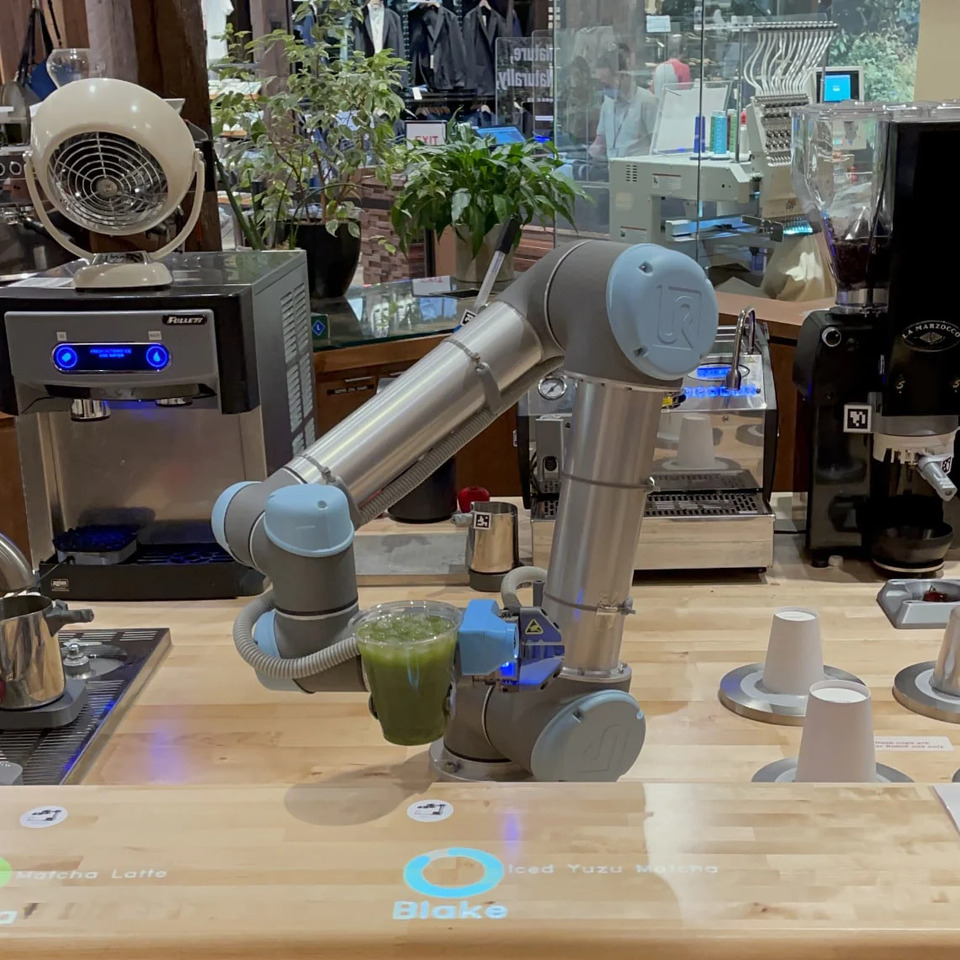
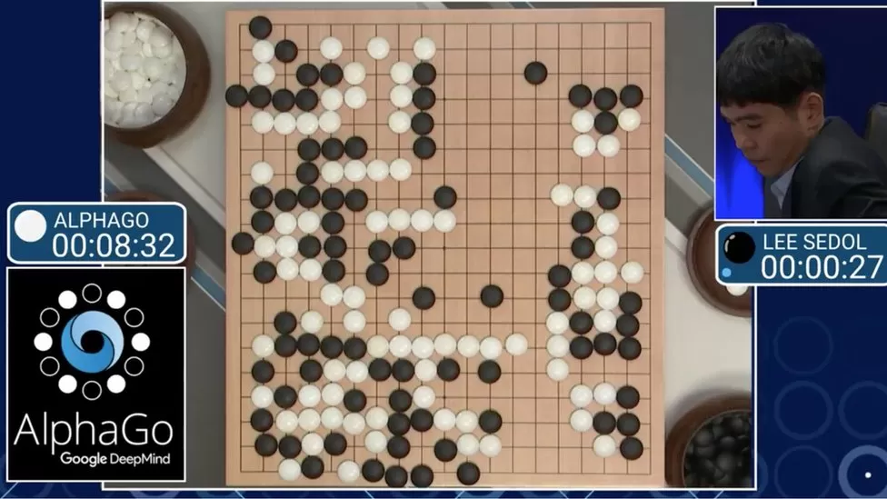
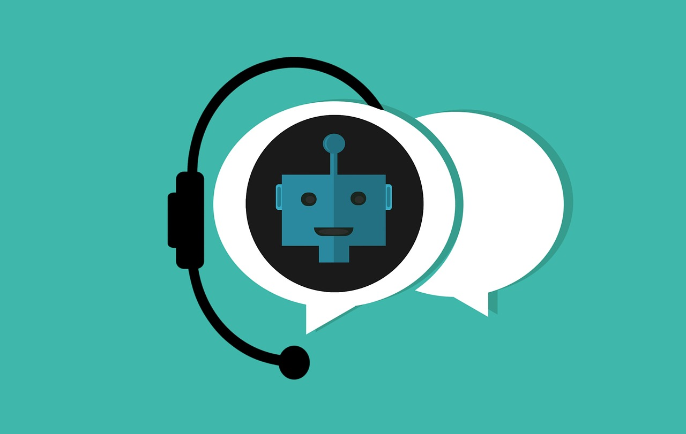
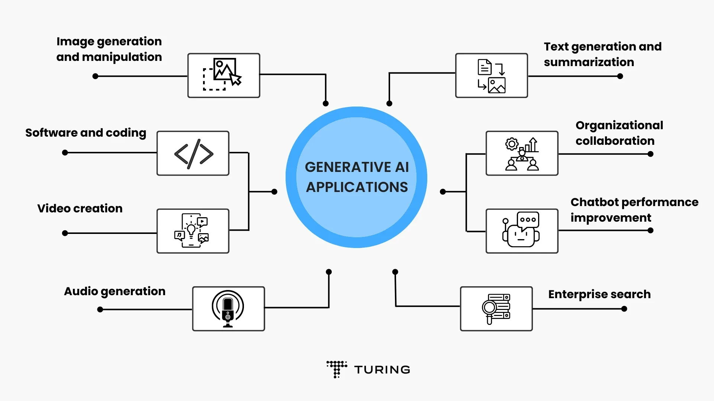

# The AI Advantage: Boosting Efficiency and Productivity in the Workplace

Chris Chua

---

<!-- _class: invert lead -->

## Copyright Notice

All slides from this presentation, in whole or in part, are protected by copyright law. Unauthorized use, distribution, or reproduction of these slides without explicit permission from the speaker is strictly prohibited.

---

<!-- _class: invert lead -->

## Poll

1\. Have you ever used AI?
2\. Are you using AI at work?

---

## The Impact of AI

Why AI matters

---

### Disruption and Fear of Loss of Jobs

* Gartner predicts that by 2025, gen AI will be a workforce partner for 90% of companies worldwide.
— *[Gartner, October 2023 press release](https://www.gartner.com/en/newsroom/press-releases/2023-10-16-gartner-says-cios-must-prioritize-their-ai-ambition-and-ai-ready-scenarios-for-next-12-24-months)*

* Generative AI could lead to "significant disruption" in the labor market and expose 300 million full-time jobs across the globe — many of them white-collar roles — to automation.
— *[Goldman Sachs, March 2023 report](https://www.businessinsider.com/generative-ai-chatpgt-300-million-full-time-jobs-goldman-sachs-2023-3)*

* 22% of US workers were worried their jobs would become obsolete due to technology.
— *[Gallup, August 2023 survey](https://www.businessinsider.com/us-workers-worry-tech-ai-may-replace-jobs-gallup-poll-2023-9)*

---

### AI Anxious

* Only 58% of US adults have heard of ChatGPT.
Of this group, only 12% said they had used the technology to help complete work tasks.
— *[Pew Research, March 2023 survey](https://www.businessinsider.com/chatgpt-potential-users-young-educated-and-rich-pew-survey-2023-5)*

* Nearly half of employees are worried that they don't know enough about AI.
And 56% said they did not know how to use AI at work.
— *[LinkedIn, August 2023 survey](https://www.businessinsider.com/employees-ai-anxious-falling-behind-pretending-linkedin-survey-chatgpt-2023-9)*

---

### Productivity Boost

* 55% of respondents say that the current output of generative AI tools they're using matches the quality of an experienced or expert human worker.
— *[The Conference Board, August 2023 workforce survey](https://www.prnewswire.com/news-releases/survey-majority-of-us-workers-are-already-using-generative-ai-toolsbut-company-policies-trail-behind-301925743.html)*

* 70% of respondents said they would like to delegate as much work as possible to AI to lessen their current workload.
— *[Microsoft, May 2023 Work Trend Index Annual Report](https://www.microsoft.com/en-us/worklab/work-trend-index/will-ai-fix-work)*

* Generative AI can improve a highly skilled worker’s performance by as much as 40% compared with workers who don’t use it.
— *[Dell'Acqua et al., 2023, "Navigating the Jagged Technological Frontier: Field Experimental Evidence of the Effects of AI on Knowledge Worker Productivity and Quality"](https://papers.ssrn.com/sol3/papers.cfm?abstract_id=4573321)*

---

<!-- _class: invert lead -->

### <!-- fit --> "AI won't take your job. It's somebody using AI that will take your job." 

— *[Richard Baldwin, economist and professor at the Geneva Graduate Institute (Switzerland) during a panel at the 2023 World Economic Forum's Growth Summit.](https://www.businessinsider.com/ai-wont-take-your-job-someone-who-uses-it-might-2023-5)*

---

## Demystifying AI

What is AI and what is it used for

---

### What is AI?

> AI stands for Artificial Intelligence, the science and engineering of creating intelligent machines and systems.

AI can perform tasks that normally require human intelligence, such as understanding natural language and making decisions. Just like how you learn new things every day, AI can also learn and become smarter!

---

### Main Categories of AI

* [Machine Learning and Deep Learning](#machine-learning-and-deep-learning)
* [Robotics AI](#robotics-ai)
* [Reinforcement Learning](#reinforcement-learning)
* [Natural Language Processing (NLP)](#natural-language-processing-nlp)
* [Computer Vision](#computer-vision)
* [Generative AI](#generative-ai)

---

### Machine Learning (and Deep Learning)

> Machine learning is a fundamental category that focuses on developing algorithms and models that enable machines to learn from data and make predictions or decisions without being explicitly programmed.

E.g. recommendation systems such as Netflix and Amazon's "People also bought this", and disease diagnosis.

---

<!-- _class: invert lead -->

### The Power of Recommendation Systems

---

### Robotics AI

> Robotics AI involves creating intelligent machines capable of interacting with the physical world. It combines elements of perception, decision making, and control to enable robots to perform tasks autonomously.

E.g. drones, autonomous vehicles, robots

---

<!-- _class: invert lead -->

### Artly the Barista Bot *(24s video)*

---

### Reinforcement Learning

> Reinforcement learning is a type of machine learning where an agent learns to make decisions through trial and error, receiving feedback in the form of rewards or penalties based on its actions.

---

### Natural Language Processing (NLP)

> NLP involves teaching machines to understand and process human language. It encompasses tasks like speech recognition, language translation, sentiment analysis, and text generation.

---

### Computer Vision

> Computer vision involves enabling machines to interpret and understand visual information, such as images and videos. It includes tasks like object recognition, image classification, and facial recognition.

E.g. facial recognition, optical character recognition (OCR), beauty filters apps

---

<!-- _class: invert lead -->

### Live Translation Using Phone Camera

---

### Generative AI

> Generative AI involves creating AI systems that can generate new content, such as images, music, or text. It utilizes techniques like generative adversarial networks (GANs) and variational autoencoders (VAEs) to produce realistic and creative outputs.

---

<!-- _class: invert lead -->

### Key Generative AI Applications

---

<!-- _class: invert lead -->

### Fancy a Painting?

---

### AI Avatar

* [Taiwan news anchor *(1:35 min video)*](https://share.zight.com/z8udkgjk)
* [South Korea AI-based avatar - Zae In *(1:37 min video)*](https://share.zight.com/JrumGB0O)
* [China news anchor *(30s video)*](https://share.zight.com/P8uD6qLZ)

---

## Leveraging AI

Use AI to Your Advantage

---

### Use Cases of AI at Work

* [As a Google alternative](#as-a-google-alternative)
* [Idea generation](#idea-generation)
* [Taking meeting notes](#taking-meeting-notes)
* [Content creation](#content-creation)
* [Presentations](#presentations)
* [Chatbots](#chatbots)

---

### As a Google Alternative

* No more clicking and reading so many search results
* Able to compile information from multiple webpages
* Avoid the bombardment of advertisements
* AI can simplify the explanation if you ask it to
* Get information sources

---

### Idea Generation

* Assist in brainstorming sessions by suggesting new ideas, prompting creative thinking, and challenging assumptions
* Process and evaluate multiple ideas, helping to narrow down the options and identify the most promising ones
* Analyze vast amounts of data and generate insights that humans may not be able to discover on their own

---

### Taking Meeting Notes

* Transcribe meeting notes with high accuracy, reducing the chances of errors
* Transcribe meeting notes in real-time
* Can understand various languages
* Summarize and extract key points

---

### Content Creation

* Cheaper and faster to write an email, article, social media post, or report
* Error-free and consistent content, reducing the risk of typos and grammar mistakes
* Create personalized and targeted copy that resonates with specific audiences
* Translate content into multiple languages, enabling companies to reach a global audience

---

### Presentations

* Automated content creation
* create visually stunning presentations by generating high-quality graphics, animations, and design layouts
* Translate presentations into different languages
* Assist presenters in creating compelling narratives by suggesting story structures and identifying key points

---

### Chatbots

* 24/7 availability
* Provide instant responses and assistance to customers, enhancing the overall customer experience
* Provide accurate and relevant information to customers in a timely manner
* Support multiple languages

---

## AI Toolbox

Making your AI dreams come true

---

### Suggested AI Tools (I)

| Tool      | Category  | Free/Paid | Remarks   |
| --------- | --------- | --------- | --------- |
| [OpenAI ChatGPT](https://chat.openai.com/) | LLM | Free/Paid | Free version is limited to data before Jan 2022. Paid version allows for internet access, longer text inputs, upload files. |
| [Microsoft Bing AI](https://www.bing.com/search?q=Bing+AI&showconv=1)| LLM | Free | Internet access, cite sources, image generation, accepts image and voice inputs, works well with Microsoft's ecosystem. |
| [Anthropic Claude](https://claude.ai/chats) | LLM | Free | Limited daily usage, internet access, cite sources, longer text inputs, accepts `.pdf`, `.docx`, `.csv`. |

---

### Suggested AI Tools (II)

| Tool      | Category  | Free/Paid | Remarks   |
| --------- | --------- | --------- | --------- |
| [Google Bard](https://bard.google.com/chat) | LLM | Free | Internet access, prioritize visuals when answering, accepts image and voice inputs, works well with Google's ecosystem, still under development. |
| [Perplexity](https://www.perplexity.ai/) | LLM | Free/Paid |  Free version limits text and `pdf` to 3 uploads a day. Internet access, cite sources, better fact-check. |
| [Harpa AI](https://harpa.ai/) | LLM | Free | Chrome extension that is context-aware such as a website, webpage, PDF, YouTube video.|
| [ChatPDF](https://www.chatpdf.com/) | LLM | Free | Answer based on a PDF.

---

### Suggested AI Tools (III)

| Tool      | Category  | Free/Paid | Remarks   |
| --------- | --------- | --------- | --------- |
| [Jasper AI](https://www.jasper.ai/) | Copywriting | Paid | All-in-one copywriting|
| [Writesonic](https://writesonic.com/) | Copywriting | Free/Paid | SEO-focused articles |
| [Hypotenuse AI](https://www.hypotenuse.ai/) | Copywriting | Paid | Copywriting | Repurpose content, academic paraphrasing |
| [Copy AI](https://www.copy.ai) | Copywriting | Free/Paid | [Free paraphrasing tool](https://www.copy.ai/tools/paraphrase-tool) |
| [Rytr](https://rytr.me/) | Copywriting | Free/Paid | Multi-lingual rewriter, paraphrasing tool, plagiarism checker

---

### Suggested AI Tools (IV)

| Tool      | Category  | Free/Paid | Remarks   |
| --------- | --------- | --------- | --------- |
| [Canva Pro](https://canva.com) | Social Media | Paid | Text to Image, Magic Edit, Magic Design, Magic Eraser, AI Background Remover |
| [Microsoft Designer](https://designer.microsoft.com/) | Social Media | Free | Limited customization |
| [Microsoft Powerpoint](https://www.microsoft.com/en/microsoft-365/powerpoint) | Presentations | Paid | Inconsistent design, hard to incorporate corporate branding |
| [Tome](https://tome.app/) | Presentations | Paid | Difficult to edit content and design |
| [Beautiful AI](https://www.beautiful.ai/) | Presentations | Paid | Difficult to edit content and design |

---

### Suggested AI Tools (V)

| Tool      | Category  | Free/Paid | Remarks   |
| --------- | --------- | --------- | --------- |
| [ElevenLabs](https://elevenlabs.io/) | Voice | Free/Paid | Free version good for English voices |
| [Descript](https://www.descript.com/) | Voice | Free/Paid | Voice generation and video dubbing |
| [Speechki](https://speechki.io/) | Voice | Paid | Good option for non-English voices |
| [Otter AI](https://otter.ai/) | Voice | Free/Paid | Speech-to-text |
| [Grammarly](https://www.grammarly.com/) | Grammar/Spell | Free/Paid | |
| [Quillbot Grammar](https://quillbot.com/grammar-check) | Grammar/Spell | Free/Paid | |

---

### Suggested AI Tools (VI)

| Tool      | Category  | Free/Paid | Remarks   |
| --------- | --------- | --------- | --------- |
| [DALL-E 3](https://openai.com/dall-e-3) | Images | Paid | High quality, not beginner friendly |
| [Bing Image Creator](https://www.bing.com/create) | Images | Free | Powered by DALL-E 3, simple but not customizable |
| [Midjourney](https://zapier.com/blog/how-to-use-midjourney/) | Images | Paid | Access via Discord, high quality, not beginner friendly |
| [Leonardo AI](https://leonardo.ai/) | Images | Free | High quality, not beginner friendly |
| [Adobe Photoshop](https://www.adobe.com/products/photoshop.html) | Images | Paid | High quality, more for photo editing |

---

<!-- _class: invert lead -->

### Adobe Photoshop x Firefly *(1:01 minute video)*

---

## Challenges and Opportunites

The road ahead

---

### Current Challenges

* Lack of transparency: black box model and responses can be unpredictable, resulting in lack of trust in AI responses.
* Baised responses: bias in training data, algorithms, outcomes.
* Inaccuracy: often produce inaccurrate or fabricated responses.
* Privacy concerns: AI can remember private or sensitive data .inputs, making it a concern for corporate and individual security and privacy.
* Intelluctual property (IP) issues: ethical and legal concerns regarding the ownership and usage of generated content trained on proprietary or copyrighted data.

*[Taken from: www.turing.com. (n.d.). Top Generative AI Industry Applications & Use Cases of 2023](https://www.turing.com/resources/generative-ai-applications)*

---

<!-- _class: invert lead -->

### AI Hallucinations

---

### Future Trends and Opportunities

* Enhancement in the quality of AI output.
* Ethical AI governance: As AI becomes more prevalent, there will be an increased focus on ethical AI governance frameworks and regulations. This includes ensuring fairness, accountability, transparency, and responsible use of AI technologies.
* Explainable AI: Explainable AI aims to make AI systems more transparent and interpretable, allowing users to understand how the system arrived at a particular decision or recommendation.
* Human-AI collaboration: Rather than solely replacing humans, AI is expected to augment human capabilities and enable more effective collaboration between humans and machines.

---

## AI Whisperer

How to talk to an AI model

---

## How to create a perfect ChatGPT prompt

1. Start with an action word
1. Provide context
1. Assume an Identity / Assign a Role
1. Use quotation marks to emphasize
1. Be specific (give clear and specific instructions)
1. Give examples
1. State the output format (style, length, language, tone)
1. Refine the response

*[Taken from: Writesonic (2023). How to write the perfect ChatGPT prompt and become a ChatGPT expert](https://writesonic.com/blog/how-to-write-chatgpt-prompts/)*

---

## Key Takeaways

* Artificial intelligence will be part of our future. It’s inevitable. — *Sundar Pichai, CEO of Google*

* Artificial intelligence is not a replacement for humans. It’s about amplifying human potential. — *Amir Husain, CEO of SparkCognition*

* Learning is a lifelong journey. If you stop learning, you risk becoming obsolete. — *John C. Maxwell, bestselling author, speaker, and leadership expert*

---

## Q&A Time

Open-floor discussion

---

<!-- _class: invert lead -->

## <!-- fit --> Thank You

---

## Credits (I)

<!-- The AI Advantage [Cash Macanaya | Unsplash](https://unsplash.com/photos/two-hands-reaching-for-a-flying-object-in-the-sky-X9Cemmq4YjM)
-->

* What is AI? [Xu Haiwei | Unsplash](https://unsplash.com/photos/stainless-steel-robot-toy-in-close-up-photography-_3KdlCgHAn0)
* Machine Learning (and Deep Learning) [MobileSyrup](https://mobilesyrup.com/2017/08/22/80-percent-netflix-shows-discovered-recommendation/)
* The Power of Recommendation Systems [MobileSyrup](https://mobilesyrup.com/2017/08/22/80-percent-netflix-shows-discovered-recommendation/)
* Robotics AI [The Guardian](https://www.theguardian.com/technology/2014/may/28/google-self-driving-car-how-does-it-work)
* Artly the Barista Bot [Artly](https://artly.coffee/)
* Reinforcement Learning [BBC](https://www.bbc.com/news/technology-35785875)
* Natural Language Processing (NLP) [Mohamed Hassan | Pixabay](https://pixabay.com/illustrations/chatbot-bot-assistant-support-icon-4071274/)
* Computer Vision [美颜相机 by Meitu](https://meiyan.meipai.com/index.html)
* Live Translation Using Phone Camera [G2](https://learn.g2.com/google-translates-instant-camera)
* Generative AI [Levart_Photographer | Unsplash](https://unsplash.com/photos/a-computer-screen-with-a-bunch-of-buttons-on-it-drwpcjkvxuU)

---

## Credits (II)

* Key Generative AI Applications [Turing](https://www.turing.com/resources/generative-ai-applications)
* Fancy a Painting? [The New York Times](https://www.nytimes.com/2018/10/25/arts/design/ai-art-sold-christies.html)
* AI Avatar [The Guardian](https://www.theguardian.com/tv-and-radio/2023/oct/20/here-is-the-news-you-cant-stop-us-ai-anchor-zae-in-grants-us-an-interview)
* Adobe Photoshop x Firefly [Adobe](https://www.adobe.com/)
* AI Hallucinations [Forbes](https://www.forbes.com/sites/mollybohannon/2023/06/08/lawyer-used-chatgpt-in-court-and-cited-fake-cases-a-judge-is-considering-sanctions/)