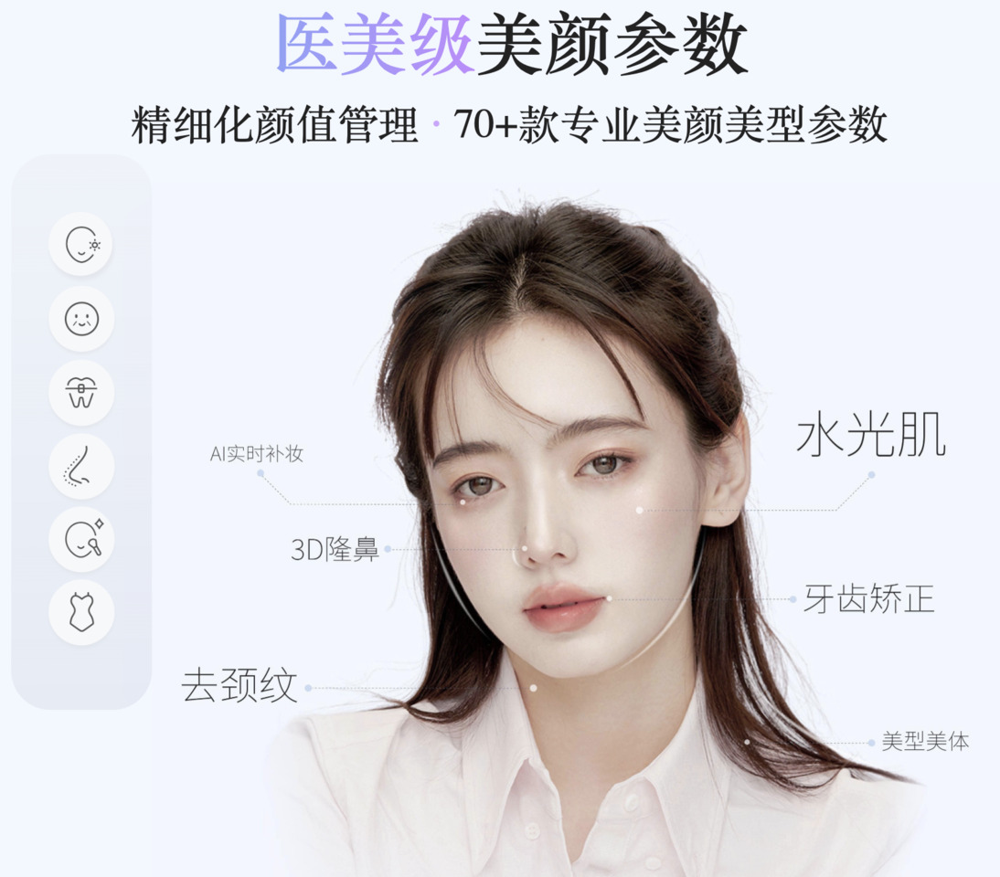

# The AI Advantage: Boosting Efficiency and Productivity in the Workplace

Chris Chua

---

## Poll

1. Have you ever used AI?
1. Are you using AI at work?

---

## AI and Its Applications

---

## What is AI?

> AI stands for Artificial Intelligence, the science and engineering of creating intelligent machines and systems.

AI can perform tasks that normally require human intelligence, such as understanding natural language and making decisions. Just like how you learn new things every day, AI can also learn and become smarter!

---

## Main Categories of AI

* Machine Learning and Deep Learning
* Robotics AI
* Reinforcement Learning
* Natural Language Processing (NLP)
* Computer Vision
* Generative AI

---

## Machine Learning (and Deep Learning)

> Machine learning is a fundamental category that focuses on developing algorithms and models that enable machines to learn from data and make predictions or decisions without being explicitly programmed.

E.g. recommendation systems such as Netflix and Amazon's "People also bought this", and disease diagnosis.

---

## The Power of Recommendation Systems

---

## Robotics AI

> Robotics AI involves creating intelligent machines capable of interacting with the physical world. It combines elements of perception, decision making, and control to enable robots to perform tasks autonomously.

E.g. drones, autonomous vehicles, robots

---

## Artly the Barista Bot *(24s video)*

---

## Reinforcement Learning

> Reinforcement learning is a type of machine learning where an agent learns to make decisions through trial and error, receiving feedback in the form of rewards or penalties based on its actions.

---

## Natural Language Processing (NLP)

> NLP involves teaching machines to understand and process human language. It encompasses tasks like speech recognition, language translation, sentiment analysis, and text generation.

---

## Computer Vision

> Computer vision involves enabling machines to interpret and understand visual information, such as images and videos. It includes tasks like object recognition, image classification, and facial recognition.

E.g. facial recognition, optical character recognition (OCR), beauty filters apps

---

## Live Translation Using Phone Camera

---

## Generative AI

> Generative AI involves creating AI systems that can generate new content, such as images, music, or text. It utilizes techniques like generative adversarial networks (GANs) and variational autoencoders (VAEs) to produce realistic and creative outputs.

---

## Key Generative AI Applications

---

## AI Avatar
<!-- Verdict: promising but still needs more work -->

- [Taiwan news anchor *(1:35 min video)*](https://share.zight.com/z8udkgjk)
- [South Korea AI-based avatar - Zae In *(1:37 min video)*](https://share.zight.com/JrumGB0O)
- [China news anchor *(30s video)*](https://share.zight.com/P8uD6qLZ)

---

## The Impact of AI in the Workplace

---

## Disruption and Fear of Loss of Jobs

* Gartner predicts that by 2025, gen AI will be a workforce partner for 90% of companies worldwide.
— *[Gartner, October 2023 press release](https://www.gartner.com/en/newsroom/press-releases/2023-10-16-gartner-says-cios-must-prioritize-their-ai-ambition-and-ai-ready-scenarios-for-next-12-24-months)*

* Generative AI could lead to "significant disruption" in the labor market and expose 300 million full-time jobs across the globe — many of them white-collar roles — to automation.
— *[Goldman Sachs, March 2023 report](https://www.businessinsider.com/generative-ai-chatpgt-300-million-full-time-jobs-goldman-sachs-2023-3)*

* 22% of US workers were worried their jobs would become obsolete due to technology.
— *[Gallup, August 2023 survey](https://www.businessinsider.com/us-workers-worry-tech-ai-may-replace-jobs-gallup-poll-2023-9)*

---

## AI Anxious

* Only 58% of US adults have heard of ChatGPT.
Of this group, only 12% said they had used the technology to help complete work tasks.
— *[Pew Research, March 2023 survey](https://www.businessinsider.com/chatgpt-potential-users-young-educated-and-rich-pew-survey-2023-5)*

* Nearly half of employees are worried that they don't know enough about AI.
And 56% said they did not know how to use AI at work.
— *[LinkedIn, August 2023 survey](https://www.businessinsider.com/employees-ai-anxious-falling-behind-pretending-linkedin-survey-chatgpt-2023-9)*

---

## Productivity Boost

* 55% of respondents say that the current output of generative AI tools they're using matches the quality of an experienced or expert human worker.
— *[The Conference Board, August 2023 workforce survey](https://www.prnewswire.com/news-releases/survey-majority-of-us-workers-are-already-using-generative-ai-toolsbut-company-policies-trail-behind-301925743.html)*

* 70% of respondents said they would like to delegate as much work as possible to AI to lessen their current workload.
— *[Microsoft, May 2023 Work Trend Index Annual Report](https://www.microsoft.com/en-us/worklab/work-trend-index/will-ai-fix-work)*

* When workers had access to ChatGPT, the time it took for them to complete a series of work-related writing tasks decreased by 40%, and the quality of their output rose by 18%.
— *[MIT, July 2023 study](https://news.mit.edu/2023/study-finds-chatgpt-boosts-worker-productivity-writing-0714)*

---

## Credits

<!-- The AI Advantage [Cash Macanaya | Unsplash](https://unsplash.com/photos/two-hands-reaching-for-a-flying-object-in-the-sky-X9Cemmq4YjM)
-->

* What is AI? [Xu Haiwei | Unsplash](https://unsplash.com/photos/stainless-steel-robot-toy-in-close-up-photography-_3KdlCgHAn0)
* Machine Learning (and Deep Learning) [MobileSyrup](https://mobilesyrup.com/2017/08/22/80-percent-netflix-shows-discovered-recommendation/)
* The Power of Recommendation Systems [MobileSyrup](https://mobilesyrup.com/2017/08/22/80-percent-netflix-shows-discovered-recommendation/)
* Robotics AI [The Guardian](https://www.theguardian.com/technology/2014/may/28/google-self-driving-car-how-does-it-work)
* Artly the Barista Bot [Artly](https://artly.coffee/)
* Reinforcement Learning [BBC](https://www.bbc.com/news/technology-35785875)
* Natural Language Processing (NLP) [Mohamed Hassan | Pixabay](https://pixabay.com/illustrations/chatbot-bot-assistant-support-icon-4071274/)
* Computer Vision [美颜相机 by Meitu](https://meiyan.meipai.com/index.html)
* Live Translation Using Phone Camera [G2](https://learn.g2.com/google-translates-instant-camera)
* Generative AI [Levart_Photographer | Unsplash](https://unsplash.com/photos/a-computer-screen-with-a-bunch-of-buttons-on-it-drwpcjkvxuU)
* Key Generative AI Applications [Turing](https://www.turing.com/resources/generative-ai-applications)
* AI Avatar [The Guardian](https://www.theguardian.com/tv-and-radio/2023/oct/20/here-is-the-news-you-cant-stop-us-ai-anchor-zae-in-grants-us-an-interview)

---

## Slide 2
<!-- Can also do a multiline
comment that will show in notes -->

<!-- 
Some notes here that might be useful.
-->

---

## Slide 3

> This is a quote.

---

## Slide 4

| Column 1 | Column 2 |
| -------- | -------- |
| Item 1   | Item 2   |
| Item 3   | Item 4   |

---

## Slide 5

## Left

- 1
- 2

## Right

- 3
- 4

---

## Slide 6

<i class="fa-brands fa-twitter"></i> Twitter:
<i class="fa-brands fa-mastodon"></i> Mastodon:
<i class="fa-brands fa-linkedin"></i> LinkedIn:
<i class="fa fa-window-maximize"></i> Blog:
<i class="fa-brands fa-github"></i> GitHub:

---

## <!--fit--> Large Text

---

<!-- Needed for mermaid, can be anywhere in file except frontmatter -->

## Mermaid

graph TD;
    A-->B;
    A-->C;
    B-->D;
    C-->D;

